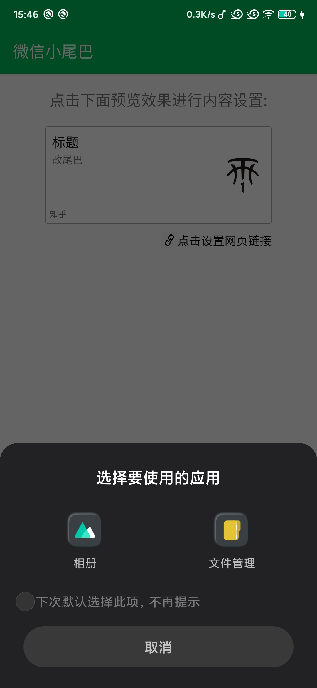

## 微信自定义分享神器

<video src="./screenshot/Screenrecorder-2020-06-16-15-41-21-442.mp4" autoplay="true" style="zoom:30%;"/>

### 此软件可以中自定义微信分享内容.

- 自定义标题
- 自定义文本
- 自定义图标
- 自定义网址
- 自定义分享尾巴

其中最厉害的就是自定义分享尾巴,可以伪装成其他app分享内容,玩法多多,自己尝试.目前支持的伪装尾巴有"腾讯新闻", "UC浏览器", "新浪微博", "今日头条", "知乎",如果有其他想支持的可以在issues中留言,我会加上.如果喜欢请点击star给个星.

## 免责声明

**本软件只用于学习交流,严禁用于任何商业用途,以及损害腾讯公司的行为,否则自行承担后果**